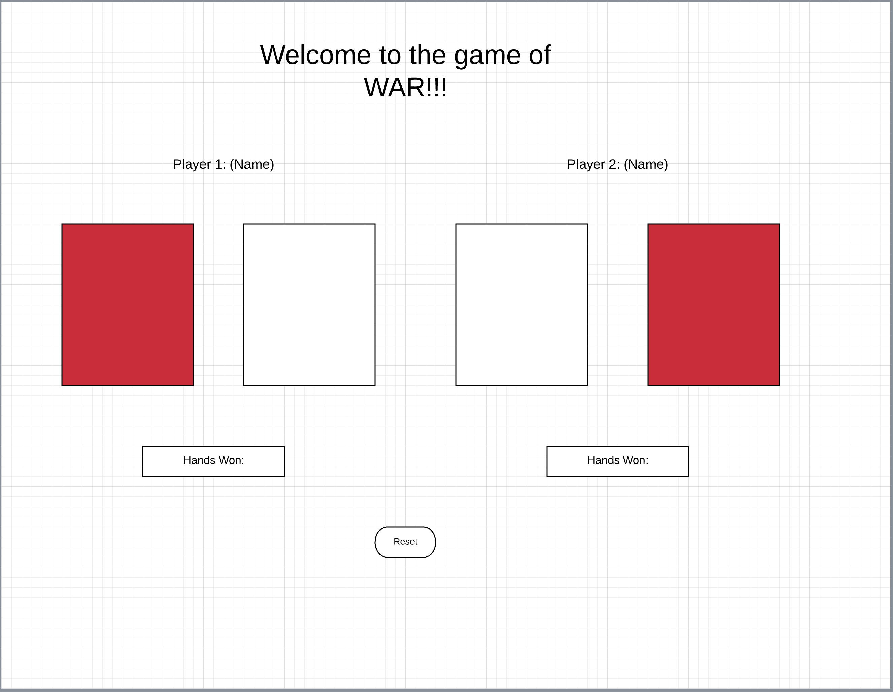
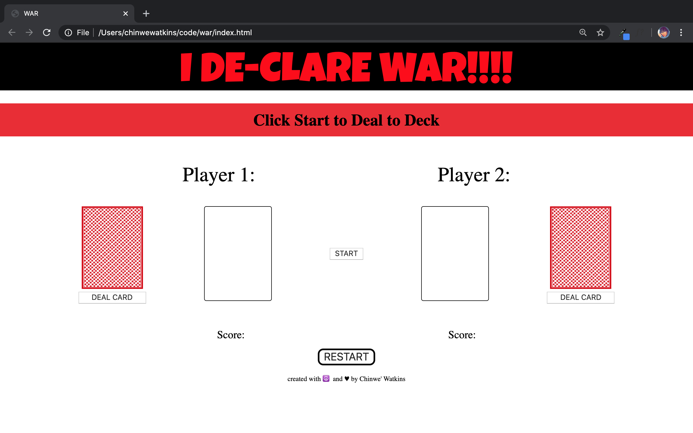
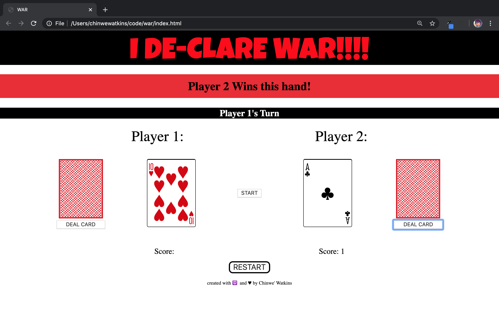

I DE-CLARE WAR!!!!

## Screenshots

Wireframe

Game Play 

## Technologies

- HTML
- CSS
- Javascript

## Getting Started

Each player turns up a card at the same time and the player with the higher card takes both cards and puts them, face down, on the bottom of his stack. If the cards are the same rank, it is War. Each player turns up one card face down and one card face up. The player with the higher cards takes both piles (six cards).

## Future Enhancements

- audio
- animation
- player 2 automation
